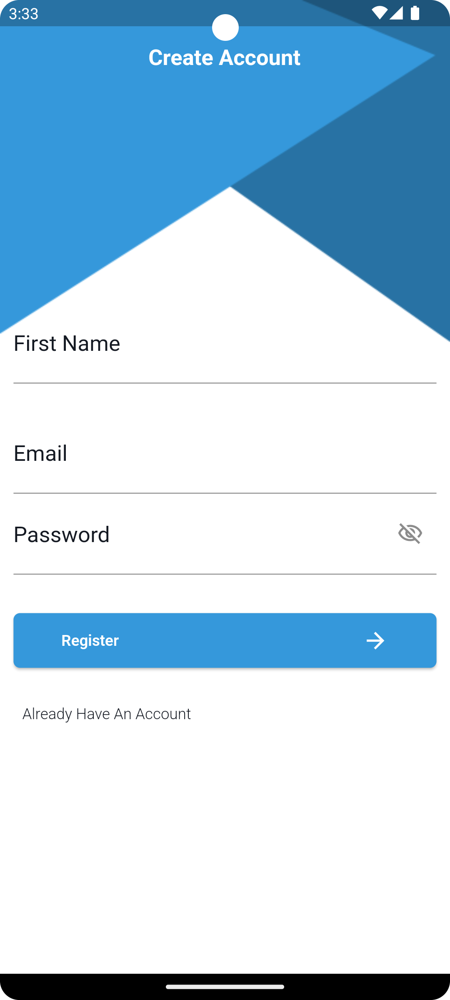
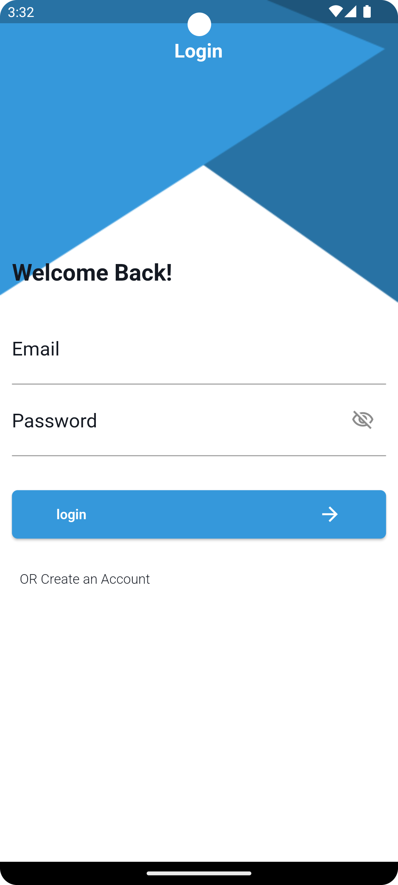
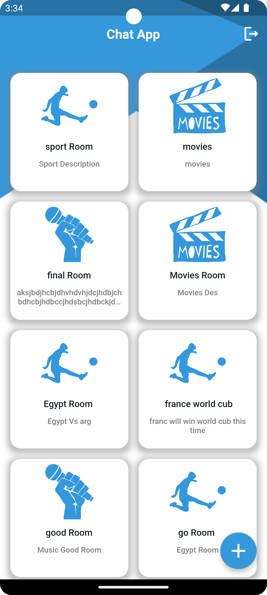
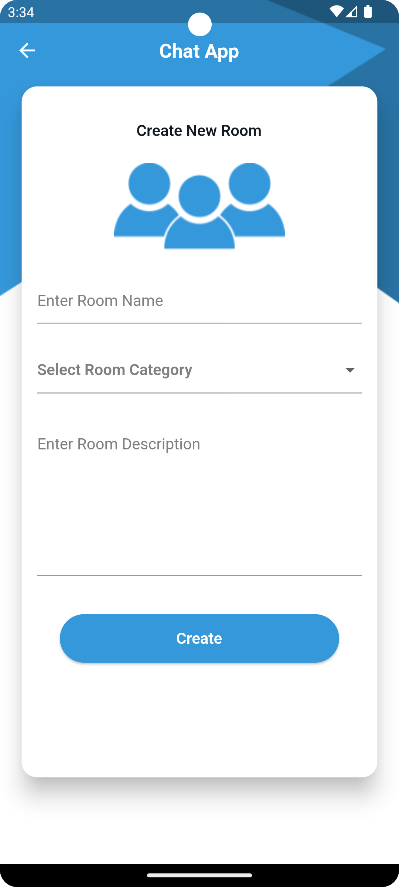
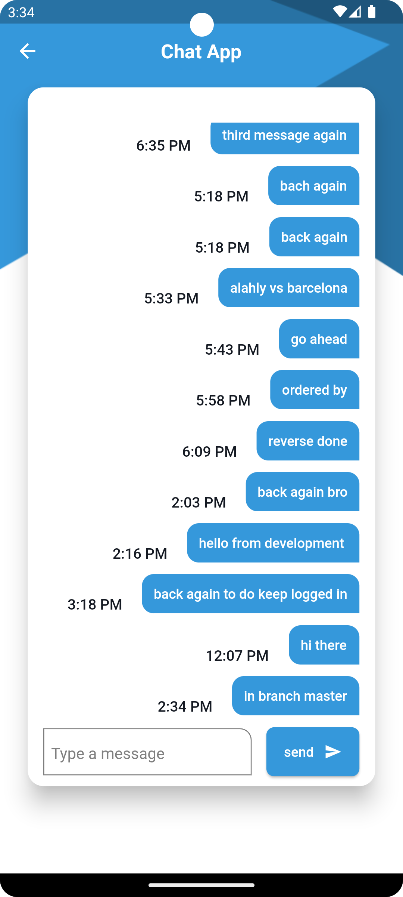

# 💬 Chat App (Real-Time Communication Platform)

A professional, real-time messaging application built with **Flutter**, featuring dynamic chat rooms and robust state management utilizing **BLoC/Cubit** and **Firebase** services.

---

## 📸 Screenshots
<p align="center">
  
  
  
</p>
<p align="center">
  
  
  
</p>

---

## 🎥 App Demo
<p align="center">
  <!-- استبدل الرابط أدناه برابط الفيديو بعد رفعه على GitHub -->
  <video src="https://github.com" width="320" autoplay loop muted playsinline></video> 
</p>

---

## 🏗️ Architecture Overview
The project follows clean development patterns ensuring absolute separation of business logic from the UI layer:
- **Data Layer (Firebase Utils):** Manages Firestore Collection References with strongly-typed converters (`withConverter`) and encapsulates Firebase Auth / Firestore interactions.
- **Presentation Layer (BLoC/Cubit):** Handles reactive app states (Initial, Loading, Success, Error states) for seamless user onboarding and real-time operations.
- **UI Layer (View):** Pure responsive Flutter widgets utilizing `BlocBuilder`, `BlocListener`, and `StreamBuilder` for state reflection and dynamic rendering.

---

## 🛠️ Tech Stack & Tools
- **State Management:** [Flutter BLoC (Cubit)](https://pub.dev) - Manages application states and core events.
- **Backend & Database:** [Firebase Core](https://pub.dev) & [Cloud Firestore](https://pub.dev) - Remote storage and live data streams.
- **Authentication:** [Firebase Auth](https://pub.dev) - Secure email and password workflows.
- **Design Tools:** Asset-based responsive scaling, native splash screens, and customized launcher icons.

---

## ✨ Key Features
- **User Authentication:** Robust login/registration processes connected directly to Firebase Auth.
- **User Persistence (Keep Logged In):** Secure session caching that checks user states during startup to bypass login for active users.
- **Dynamic Categorized Rooms:** Allows users to create and join specific interest-based rooms (e.g., Sports, Movies, Music) with automated image mapping.
- **Instant Live Chatting:** Real-time bi-directional messaging powered by reactive Firestore `Streams` wrapped inside an inverted `StreamBuilder` UI pipeline.

---

## 🚀 Technical Challenges & Solutions
- **Handling Safe Initialization with Late Variables:** Protected `Cubit` structures from premature data calls by strict lifecycle bindings within `didChangeDependencies` to prevent `LateInitializationError` crashes.
- **Keyboard Overlay & UI Constraints Management:** Prevented `RenderFlex` and overflow bugs during active text input by replacing restrictive containers with flexible scroll components and assigning proper `resizeToAvoidBottomInset` behaviors.
- **Memory Leak Mitigation:** Properly implemented controller lifecycles and garbage collection by enforcing explicit `.dispose()` calls over text field attachments when views are destroyed.

---

## ⚙️ How to Run
1. **Clone the repository:**
   ```bash
   git clone https://github.com/fouadTharwat3616/chat
   ```
2. **Install dependencies:**
   ```bash
   flutter pub get
   ```
3. **Firebase Configuration:**
    - Make sure to add your own `google-services.json` (for Android) and `GoogleService-Info.plist` (for iOS) into the respective directories, or run `flutterfire configure`.
4. **Run the app:**
   ```bash
   flutter run
   ```

---

## 👨‍💻 Author
**Fouad Tharwat**
https://github.com/fouadTharwat3616/chat

